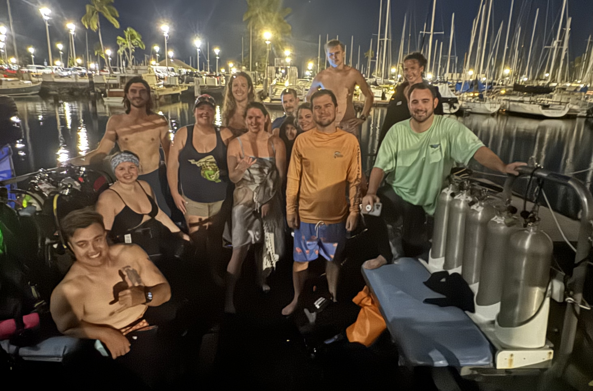

### Trusted Science Center Presentations

#### , Robert W. Eckelbecker, Henry J. Hershey, Stephen W. Parker.  
**Assessing freshwater length limit management strategies: a meta-analysis to bridge knowledge gaps.** *(Talk)*  

#### , Kimberly I. Bonvechio, Alex W. Mott, , , , Kyle R. Piller. 
**Creating a Lake Maurepas long-term monitoring program through integrative experiences.** *(Poster)*  

#### , , , , Christopher M. Murray. 
**Impacts of perfluoropentanoic acid and cadmium on leukocyte profiles in largemouth bass.** *(Poster)*  

#### , , , Alex W. Mott, Kyle R. Piller. 
**Condition indices of Ictalurid catfishes in Lake Maurepas, Louisiana.** *(Poster)*

---