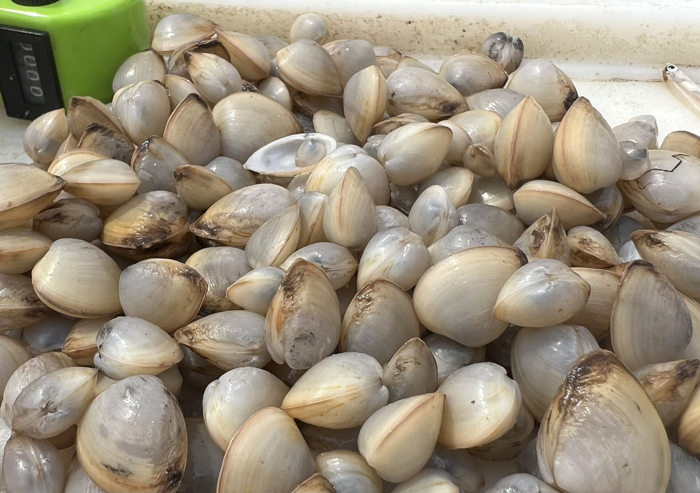
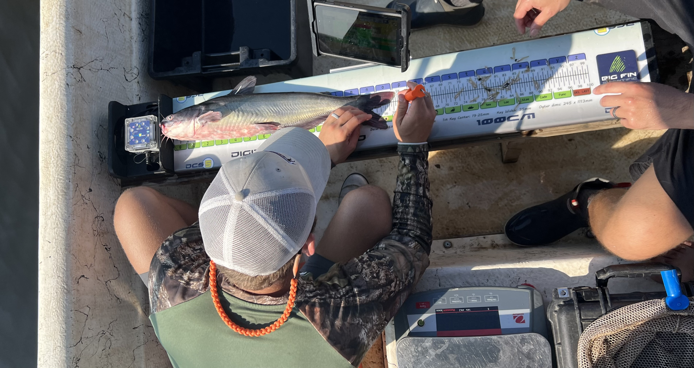

## 🐠 Trusted Science Center Presentations

---

### **Examining variation of invertebrate biodiversity in Lake Maurepas, Louisiana**  
*Talk*  
**Alex W. Mott, , , , and Kyle R. Piller**  

  

---

### **Condition indices of Ictalurid catfishes in Lake Maurepas, Louisiana**  
*Poster*  
**, , , Alex W. Mott, and Kyle R. Piller**

  

---

Members of the Trusted Science Center presented two projects at the Louisiana Chapter AFS Conference in Thibodaux, Louisiana — continuing our mission to link quantitative research with applied management across Louisiana’s aquatic ecosystems.

---