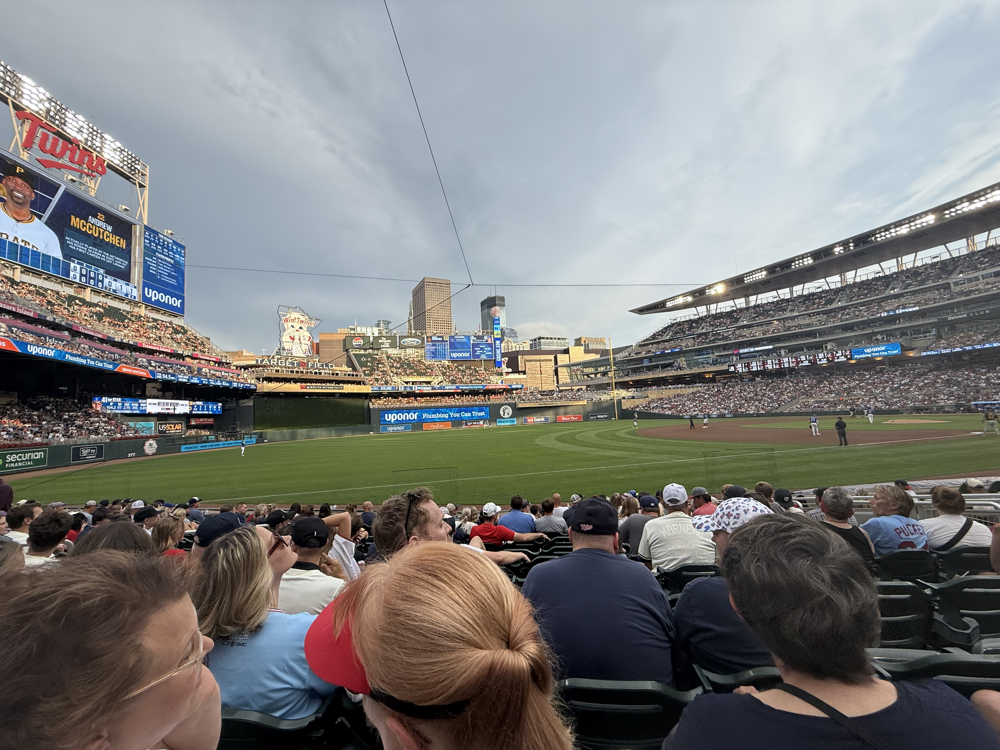

### Trusted Science Center Presentations

#### , Claire E. Gard, ,  Kyle R. Piller.  
**Comparing active and passive methods of aquatic environmental DNA collection across a diel cycle in a coastal riverine habitat.** *(Talk)*  

Cam does a great job representing Southeastern Louisiana University, the Center for Environmental Research, and the TSC.

---