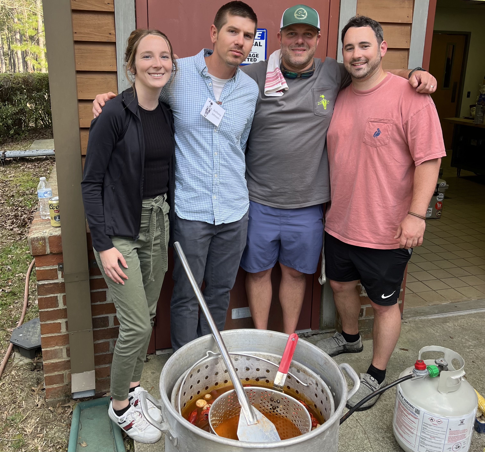

### Trusted Science Center Presentations

#### , , Davinia Beneyto Garrigos, Mahmood Sasa Marin, Christopher M. Murray.
**Hydrology drives behavioral flexibility in the seasonal movements of American crocodiles** *(Crocodylus acutus)* **in Costa Rica.** *(Talk)*  

#### , , Christopher M. Murray.
**Landscape physiology and drivers of stress in the American alligator** *(Alligator mississippiensis)***.** *(Talk)*  

#### , , Jorge Lopez-Perez, Christopher M. Murray.
**Light and density effects on American alligator** *(Alligator mississippiensis)* **stress and scarring in aquacultural facilities.** *(Talk)*  

---