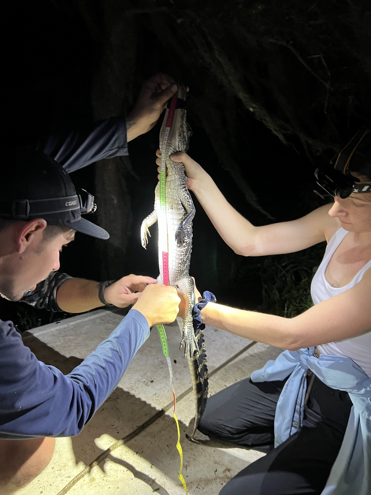
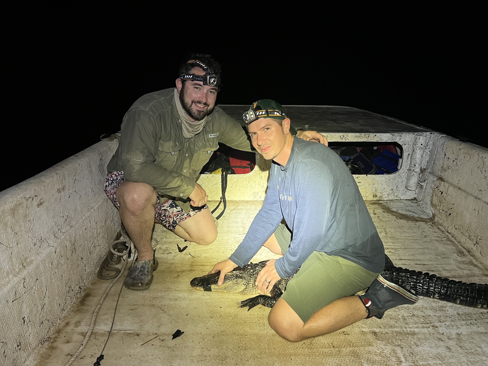

## 🐊 Trusted Science Center Presentations

---

### **Hydrology drives behavioral flexibility in the seasonal movements of American crocodiles (*Crocodylus acutus*) in Costa Rica**  
*Talk*  
**, , Davinia Beneyto Garrigos, Mahmood Sasa Marin, Christopher M. Murray**

  
*Click image to enlarge*

---

### **Landscape physiology and drivers of stress in the American alligator (*Alligator mississippiensis*)**  
*Talk*  
**, , Christopher M. Murray**

  
*Click image to enlarge*

---

### **Light and density effects on American alligator (*Alligator mississippiensis*) stress and scarring in aquacultural facilities**  
*Talk*  
**, , Jorge Lopez-Perez, Christopher M. Murray**

---

Maggie, Anthony, and Lani represented the Trusted Science Center and Southeastern Louisiana University with energy and professionalism — sharing exciting advances in alligator and crocodilian research.

---