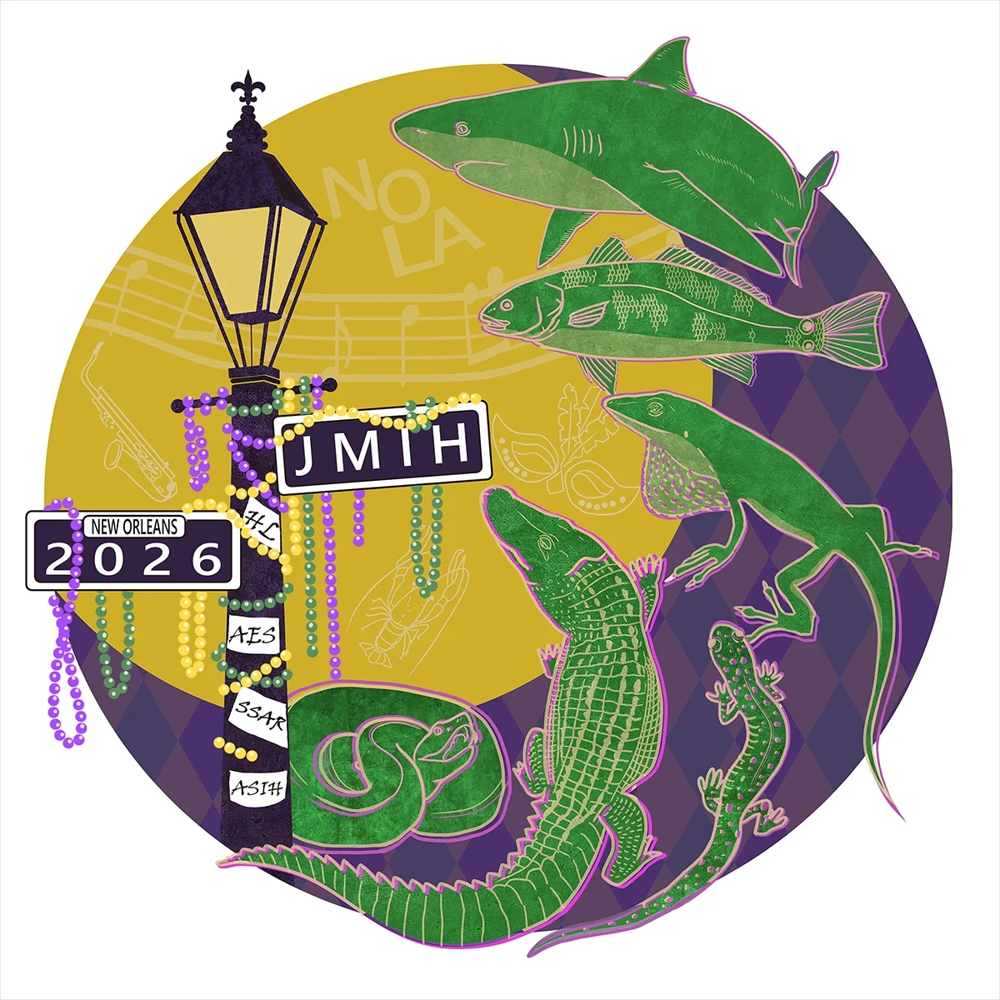

## 🐟 Trusted Science Center Presentations

---

### **Fish assemblage assessment in the littoral areas of Lake Maurepas, Louisiana**  
*Poster*  
**, , and Kyle R. Piller**

  
*Click to view full poster (PDF)*

---

### **Assessing the efficacy of using eDNA to determine biomass and abundance of anchovies (*Anchoa mitchilli* and *A. hepsetus*) in Lake Maurepas**  
*Poster*  
**, , David Camak, and Kyle R. Piller**

  
*Click to view full poster (PDF)*

---

### **Go with the flow: tracing fish assemblages along a fluvial gradient in coastal Louisiana using environmental DNA**  
*Talk*  
**, , Casey P. Kennedy, and Kyle R. Piller**

---

The team represented Southeastern Louisiana University, the Center for Environmental Research, and the Trusted Science Center with professionalism and enthusiasm — showcasing innovative eDNA approaches to aquatic research.

---