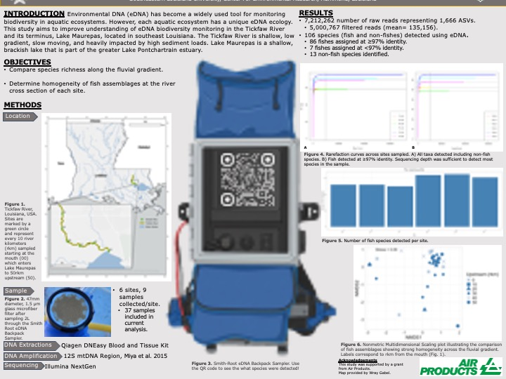

## 🏞️ Trusted Science Center Presentations

---

### **Shifting fish assemblages down a fluvial gradient in three coastal plains rivers**  
*Poster*  
**, , Casey P. Kennedy, Kyle R. Piller**

  
*Click to view full poster (PDF)*

---

---